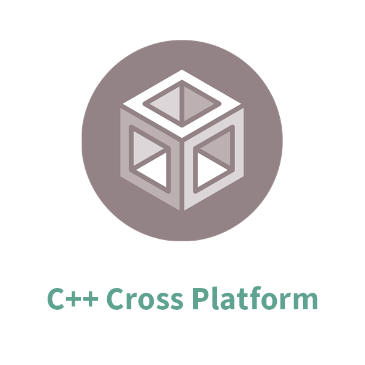

# BGT60 Radar Library

<!--  -->

C++ library for Infineon's 60 GHz Radar shield, the BGT60LTR11AIP.

## Supported Products

<table>
    <tr>
        <td></td>
    </tr>
    <tr>
        <td style="text-align: center"><a href="https://github.com/Infineon/radar-bgt60/wiki/Hardware-Platforms#radar-bgt60-pinout">BGT60LTR11AIP Shield for Arduino</a></td>
    </tr>
</table>

## Supported Frameworks

<table>
    <tr>
        <td></td>
        <td></td>
        <td></td>
    </tr>
    <tr>
        <td style="text-align: center"><a href="https://github.com/Infineon/arduino-radar-bgt60">Arduino Library</a> <a href="https://github.com/Infineon/radar-bgt60/wiki/Arduino-API">Arduino API</a></td>
        <td style="text-align: center"><a href="https://github.com/Infineon/radar-bgt60/wiki/RPi-API">RPi API</a> <a href="https://github.com/Infineon/radar-bgt60/wiki/Py-API">RPi Python API</a></td>
        <td style="text-align: center"><a href="https://github.com/Infineon/radar-bgt60/wiki/BGT60-API">BGT60 API</a></td>
    </tr>
    <tr>
        <td style="text-align: center"><a href="https://github.com/Infineon/radar-bgt60/wiki/Ino-Getting-Started">Getting Started</a></td>
        <td style="text-align: center"><a href="https://github.com/Infineon/radar-bgt60/wiki/RPi-Getting-Started">Getting Started C++</a> <a href="https://github.com/Infineon/radar-bgt60/wiki/Py-Getting-Started">Getting Started Python</a></td>
        <td style="text-align: center"><a href="https://github.com/Infineon/radar-bgt60/wiki/Porting-Guide">Porting Guide</a></td>
    </tr>
</table> <!-- TODO: Add all the missing links -->

## More Information

The complete library and project documentation can be found in the [Wiki](https://github.com/Infineon/radar-bgt60/wiki).

## License

This project is licensed under the MIT License - see the [LICENSE](LICENSE) file for details.
