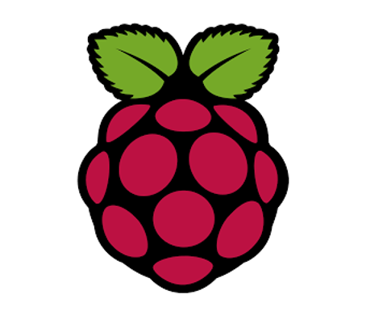

# 60 GHz Radar Library

<!--  -->

C++ library for Infineon's 60 GHz Radar shield, the BGT60LTR11AIP.

## Supported Products

<table>
    <tr>
        <td></td>
    </tr>
    <tr>
        <td style="text-align: center"><a href="">BGT60LTR11AIP Shield for Arduino</a></td> <!-- TODO: Add link to the wiki and maybe change the picture -->
    </tr>
</table>

## Supported Frameworks

<table>
    <tr>
        <td></td>
        <td></td>
        <td></td>
    </tr>
    <tr>
        <td style="text-align: center"><a href="">Arduino API</a></td>
        <td style="text-align: center"><a href="">RPi API RPi Python API</a></td>
        <td style="text-align: center"><a href="">BGT60 API</a></td>
    </tr>
    <tr>
        <td style="text-align: center"><a href="">Getting Started</a></td>
        <td style="text-align: center"><a href="">Getting Started C++</a> <a href="">Getting Started Python</a></td>
        <td style="text-align: center"><a href="">Porting Guide</a></td>
    </tr>
</table> <!-- TODO: Add all the missing links -->

## More Information

The complete library and project documentation can be found in the [Wiki](). <!-- TODO: Add missing Wiki link -->

## License

This project is licensed under the MIT License - see the [LICENSE](LICENSE) file for details.
